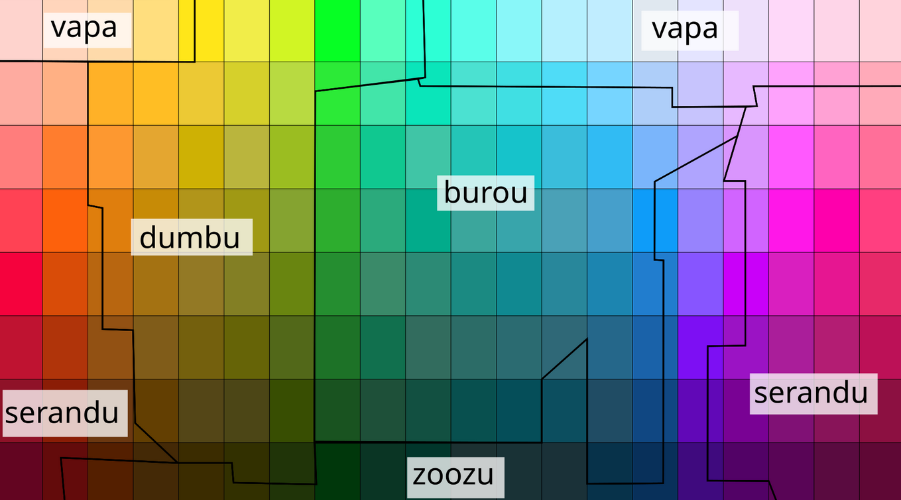
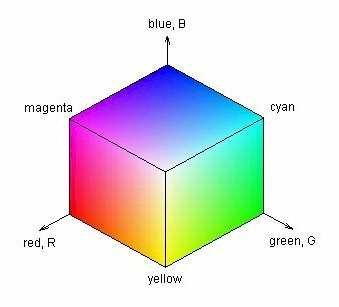
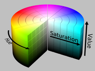
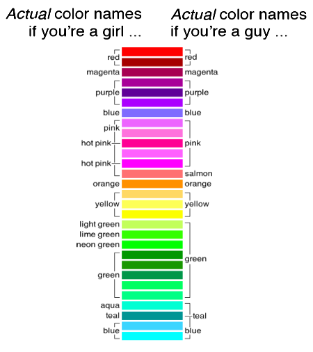
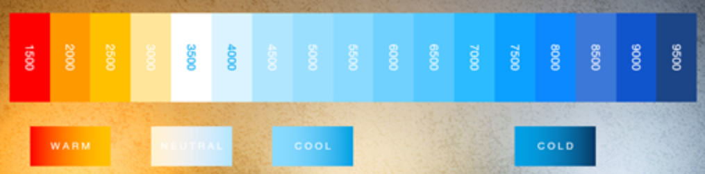
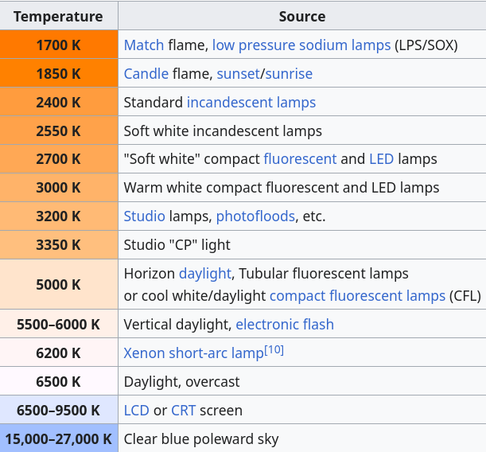

# Color, language and color spaces

Background for the design of ovos-color-parser: how languages carve up
color space, and the color models the library computes with.

  
Color and Language

Different languages are different names and numbers of colors! color is not universal!

For example, in many languages the colors described in English as "blue" and "green" are colexified, i.e., expressed
using a single umbrella term. To render this ambiguous notion in English, linguists use the blend word grue, from green
and blue

The wikipedia pages
for [Linguistic relativity and the color naming debate](https://en.wikipedia.org/wiki/Linguistic_relativity_and_the_color_naming_debate) , [Blue/Green distinction](Blue–green distinction in language)
and [Color terms](https://en.wikipedia.org/wiki/Color_term) offer a good introduction to this fascinating topic

Colors in language follow a specific evolutionary pattern. This pattern is as follows:

1. All languages contain terms for black and white.
2. If a language contains three terms, then it contains a term for red.
3. If a language contains four terms, then it contains a term for either green or yellow (but not both).
4. If a language contains five terms, then it contains terms for both green and yellow.
5. If a language contains six terms, then it contains a term for blue.
6. If a language contains seven terms, then it contains a term for brown.
7. If a language contains eight or more terms, then it contains terms for purple, pink, orange or gray.

  
Color Terms per Language

In the Bassa language, there are **two terms** for classifying colors; ziza (white, yellow, orange, and red) and hui (
black, violet, blue, and green)

In the Bambara language, there are **three color terms**: dyema (white, beige), blema (reddish, brownish), and fima (
dark green, indigo, and black).

The Ovahimba use **four color names**: zuzu stands for dark shades of blue, red, green, and purple; vapa is white and
some shades of yellow; buru is some shades of green and blue; and dambu is some other shades of green, red, and brown.

English has **11 basic color terms**: black, white, red, green, yellow, blue, brown, orange, pink, purple, and gray;
other languages have between 2 and 12. All other colors are considered by most speakers of that language to be variants
of these basic color terms

Italian, Russian and Hebrew have **twelve basic color terms**, each distinguishing blue and light blue. A Russian will
make the same red/pink and orange/brown distinctions, but will also make a further distinction between синий (sinii) and
голубой (goluboi), which English speakers would call dark and light blue. To Russian speakers, sinii and goluboi are as
separate as red and pink, or orange and brown.

  
Color Spaces

RGB uses additive color mixing, because it describes what kind of light needs to be emitted to produce a given color.
RGB stores individual values for red, green and blue. RGBA is RGB with an additional channel, alpha, to indicate
transparency. Common color spaces based on the RGB model include sRGB, Adobe RGB, ProPhoto RGB, scRGB, and CIE RGB.

CMYK uses subtractive color mixing used in the printing process, because it describes what kind of inks need to be
applied so the light reflected from the substrate and through the inks produces a given color. One starts with a white
substrate (canvas, page, etc.), and uses ink to subtract color from white to create an image. CMYK stores ink values for
cyan, magenta, yellow and black. There are many CMYK color spaces for different sets of inks, substrates, and press
characteristics (which change the dot gain or transfer function for each ink and thus change the appearance).

YIQ was formerly used in NTSC (North America, Japan and elsewhere) television broadcasts for historical reasons. This
system stores a luma value roughly analogous to (and sometimes incorrectly identified as)[9][10] luminance, along with
two chroma values as approximate representations of the relative amounts of blue and red in the color. It is similar to
the YUV scheme used in most video capture systems[11] and in PAL (Australia, Europe, except France, which uses SECAM)
television, except that the YIQ color space is rotated 33° with respect to the YUV color space and the color axes are
swapped. The YDbDr scheme used by SECAM television is rotated in another way.

YPbPr is a scaled version of YUV. It is most commonly seen in its digital form, YCbCr, used widely in video and image
compression schemes such as MPEG and JPEG.

xvYCC is a new international digital video color space standard published by the IEC (IEC 61966-2-4). It is based on the
ITU BT.601 and BT.709 standards but extends the gamut beyond the R/G/B primaries specified in those standards.

HSV (hue, saturation, value), also known as HSB (hue, saturation, brightness) is often used by artists because it is
often more natural to think about a color in terms of hue and saturation than in terms of additive or subtractive color
components. HSV is a transformation of an RGB color space, and its components and colorimetry are relative to the RGB
color space from which it was derived.

HSL (hue, saturation, lightness/luminance), also known as HLS or HSI (hue, saturation, intensity) is quite similar to
HSV, with "lightness" replacing "brightness". The difference is that the brightness of a pure color is equal to the
brightness of white, while the lightness of a pure color is equal to the lightness of a medium gray.

  
Conversion Errors

A color in one absolute color space can be converted into another absolute color space, and back again, in general;
however, some color spaces may have gamut limitations, and converting colors that lie outside that gamut will not
produce correct results. There are also likely to be rounding errors, especially if the popular range of only 256
distinct values per component (8-bit color) is used.

One part of the definition of an absolute color space is the viewing conditions. The same color, viewed under different
natural or artificial lighting conditions, will look different. Those involved professionally with color matching may
use viewing rooms, lit by standardized lighting.

Occasionally, there are precise rules for converting between non-absolute color spaces. For example, HSL and HSV spaces
are defined as mappings of RGB. Both are non-absolute, but the conversion between them should maintain the same color.
However, in general, converting between two non-absolute color spaces (for example, RGB to CMYK) or between absolute and
non-absolute color spaces (for example, RGB to L*a*b*) is almost a meaningless concept.

  
Color Names

A color term (or color name) is a word or phrase that refers to a specific color. The color term may refer to human
perception of that color (which is affected by visual context), or to an underlying physical property (such as a
specific wavelength of visible light).

There are also numerical systems of color specification, referred to as color spaces.

Not all colors have a name, think about a random combination of RGB values, we don't have names for every single hue!

  
Color lists

We expect all computers to represent a color term as the same Hex value, but does this happen in practice? Who names the
colors?

Some standards have been proposed over the years to clearly define colors as a specific number we can represent in a
computer,

- [X11 colors](https://en.wikipedia.org/wiki/X11_color_names) - In computing, on the X Window System, X11 color names
  are represented in a simple text file, which maps certain strings to RGB color values. It was traditionally shipped
  with every X11 installation, hence the name. The web colors list is descended from it but differs for certain color
  names.
- [Web colors standard](https://en.wikipedia.org/wiki/Web_colors) - Web colors are colors used in displaying web pages
  on the World Wide Web; they can be described by way of three methods: a color may be specified as an RGB triplet, in
  hexadecimal format (a hex triplet) or according to its common English name in some case
- [Crayola colors](https://en.wikipedia.org/wiki/List_of_Crayola_crayon_colors) - Since 1903, Crayola has created over
  200 distinct colors for crayons, which often correlate to physical pigments.
- [RAL colors](https://en.wikipedia.org/wiki/List_of_RAL_colours) - Used mainly in Europe, RAL colors are a standard
  color matching system administered by the German organization RAL gGmbH.
- [Traditional colors of Japan](https://en.wikipedia.org/wiki/Traditional_colors_of_Japan) - The traditional colors of
  Japan are a collection of colors traditionally used in Japanese art, literature, textiles such as kimono, and other
  Japanese arts and crafts.
- [XKCD color list](https://xkcd.com/color/rgb/) - The 954 most common RGB monitor colors, as defined by several
  hundred thousand participants in the xkcd color name survey.

Nowadays there are many online projects that attempt to "name every color", anyone can go in there and name a hex value
whatever they want, we are not considering these color names as they have no widespread adoption and are essentiallly a
joke.

  
Color Temperature

As a block of metal heats, its emitted light changes color from red to blue, with each color corresponding to a specific temperature in Kelvin, known as the “Color Temperature.”

For colors based on black-body theory, blue occurs at higher temperatures, whereas red occurs at lower temperatures. This is the opposite of the cultural associations attributed to colors, in which "red" is "hot", and "blue" is "cold".

> **food for thought**: Why are there no green stars?

Warmer colors (2700K–3000K) create a welcoming, relaxed atmosphere ideal for residential, hospitality, and lounge spaces, while cooler colors (4000K and above) provide a clean, focused environment suited for commercial, industrial, and some modern residential areas like kitchens.

## Language support
