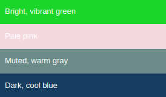
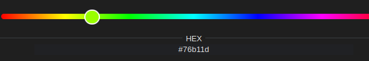
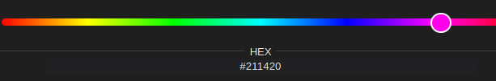

# Usage guide

## Extracting a color from text

The parser will do it's best to parse "color modifiers"

```python
from ovos_color_parser import color_from_description

names = [
    "Bright, vibrant green",
    "Pale pink",
    "Muted, warm gray",
    "Dark, cool blue",
  
]
for n in names:
    c = color_from_description(n)
    print(c.hex_str)
    print(c)
```


Color names are ambiguous, the same name sometimes refers to multiple colors. When a color is matched by the parser it "averages all matched colors"
```python
from ovos_color_parser import color_from_description

color = color_from_description("Red")
print(color.hex_str)  #D21B1B
print(color) 
# sRGBColor(r=210, g=27, b=27, name='Red', description='Red')
```


We can tell the parser to always return a known/named color with `cast_to_palette=True`, but this might not always return what you expect
```python
from ovos_color_parser import color_from_description

color = color_from_description("Red", cast_to_palette=True)
print(color.hex_str)  #CE202B
print(color)
# sRGBColor(r=206, g=32, b=43, name='Fire engine red', description='Red')
```


### Beware of impossible colors

Some colors are [impossible](https://en.wikipedia.org/wiki/Impossible_color), but that doesn't stop text from describing them

`"Reddish-green"` doesn’t make much sense as a description, unless you mean yellow or orange, which you don’t, because you would have said “yellow” or “orange”. The same applies to `"Yellowish–blue"`

> the Colour of Magic or the King Colour, was the eighth colour of the Discworld spectrum. 
Only visible to wizards and cats. It is described in "The Colour of Magic" as the colour of imagination and is a fluorescent greenish yellow-purple. 
The only time non-wizards can see it is when they close their eyes; the bursts of color are octarine.

<details>
  <summary>Why is this color impossible?</summary>

Fluorescent greenish-yellow and purple are essentially opposite colors on the color wheel, with wavelengths that can’t coexist in a single light wave in the visible spectrum. Here’s why:

1. Color Wavelengths and Light: Greenish-yellow light falls in a wavelength range of about 560–590 nanometers, while purple is not a pure spectral color but a combination of blue (around 450–495 nm) and red (around 620–750 nm). Human eyes perceive purple as a combination of these two ends of the spectrum.
2. Color Opponency Theory: The human visual system relies on color opponency, where certain pairs of colors (like red-green and blue-yellow) are processed in opposing channels. Because of this, our brains can’t interpret colors that simultaneously activate both ends of an opponent channel. This is why we don’t perceive colors like reddish-green or yellowish-blue—our brains are simply wired to cancel out those combinations.
3. Perceptual Limits: Fluorescent colors are especially intense because they emit light in a narrow, concentrated wavelength range, making them appear very saturated and bright. Attempting to mix fluorescent greenish-yellow with purple not only challenges the physiology of the eye but would also result in a muted brown or gray tone, as the colors cancel each other out.

In short, fluorescent greenish-yellow and purple light can’t coexist in a way our eyes can interpret as a single, stable color because of the biological limits of human color perception.
</details>

```python
from ovos_color_parser import color_from_description

# look! an impossible color
color = color_from_description("fluorescent greenish-yellow purple")
color.name = "Octarine"
print(color.hex_str) #76B11D
print(color)
# sRGBColor(r=118, g=177, b=29, name='Octarine', description='fluorescent greenish-yellow purple')
```
the parser will gladly output something... it just might not make sense

in this case the parser focused on `"greenish-yellow"`



but it could have focused on `"purple"`



## Comparing color objects

compare color distances (smaller is better)

```python
from ovos_color_parser import color_distance, color_from_description

color_a = color_from_description("green")
color_b = color_from_description("purple")
print(color_distance(color_a, color_b))
# 64.97192890677195

color_a = color_from_description("green")
color_b = color_from_description("yellow")
print(color_distance(color_a, color_b))
# 44.557493285361

color_a = color_from_description("yellow")
color_b = color_from_description("purple")
print(color_distance(color_a, color_b))
# 78.08287998809946
```

match a color object to a list of colors

```python
from ovos_color_parser import sRGBAColor, sRGBAColorPalette, closest_color

# https://en.wikipedia.org/wiki/Blue-green
BlueGreenPalette = sRGBAColorPalette(colors=[
  sRGBAColor(r=0, g=128, b=128, name="Blue-green"),
  sRGBAColor(r=0, g=255, b=255, name="Cyan (Aqua)", description="Brilliant bluish green"),
  sRGBAColor(r=64, g=224, b=208, name="Turquoise", description="Brilliant bluish green"),
  sRGBAColor(r=17, g=100, b=180, name="Green-blue", description="Strong blue"),
  sRGBAColor(r=57, g=55, b=223, name="Bondi blue"),
  sRGBAColor(r=0, g=165, b=156, name="Blue green (Munsell)", description="Brilliant bluish green"),
  sRGBAColor(r=0, g=123, b=167, name="Cerulean", description="Strong greenish blue"),
  sRGBAColor(r=0, g=63, b=255, name="Cerulean (RGB)", description="Vivid blue"),
  sRGBAColor(r=0, g=128, b=128, name="Teal", description="Moderate bluish green"),
])

print(closest_color(sRGBAColor(r=0, g=0, b=255, name="Blue"),
                    BlueGreenPalette.colors))
# sRGBColor(r=0, g=63, b=255, name='Cerulean (RGB)', description='Vivid blue')
print(closest_color(sRGBAColor(r=0, g=255, b=0, name="Green"),
                    BlueGreenPalette.colors))
# sRGBColor(r=64, g=224, b=208, name='Turquoise', description='Brilliant bluish green')
```

